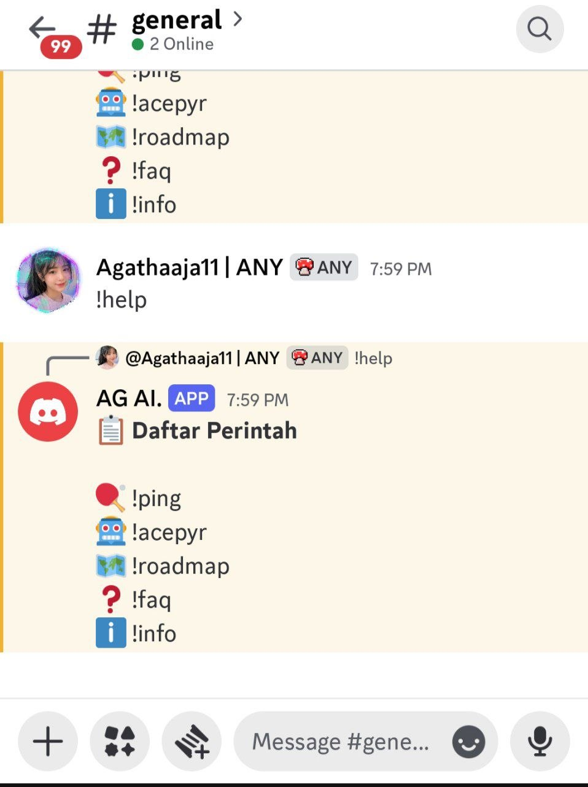

# GM Discord Bot

A simple Discord bot built with Node.js and discord.js.

## ✨ Features

- 🏓 !ping - Check bot response
- 🤖 !acepyr - Information about Acepyr
- 🗺️ !roadmap - Display Acepyr roadmap
- ❓ !faq - Frequently asked questions
- 📋 !help - Show available commands
- ℹ️ !info - Bot information

## 📦 Installation

Clone the repository:

```bash
git clone https://github.com/maharani212/gm.git
```

Install dependencies:

```bash
npm install
```

## ⚙️ Configuration

Create a `.env` file:

```env
DISCORD_TOKEN=YOUR_DISCORD_TOKEN
```

## ▶️ Run

```bash
node index.js
```

## 🛠 Technologies

- Node.js
- discord.js
- dotenv

## 👩‍💻 Author

GitHub: **maharani212**

## 📄 License

MIT License
## 📸 Preview

Berikut tampilan bot saat menjalankan perintah `!help`:

